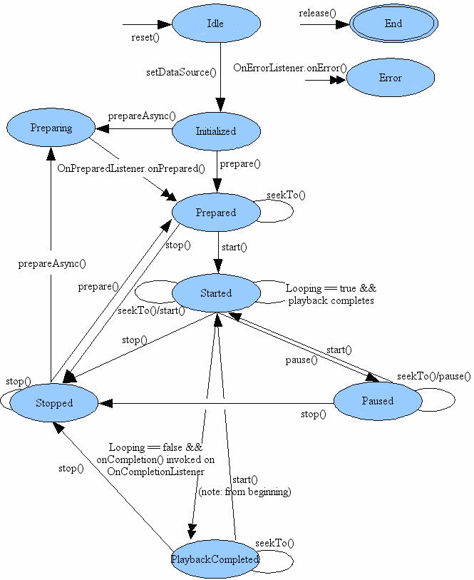

JCVideoPlayer 两个关键类 ：视频播放 基于MediaPlayer https://github.com/lipangit/JieCaoVideoPlayer 

播放器FrameLayout，（放TextureView的）JCVideoPlayer#setUp(String url, int screen, Object... objects)

核心， JCMediaManager.（TextureView和MediaPlayer） onSurfaceTextureAvailable  onPrepared(MediaPlayer mp)

TextureView 视频流数据容器。 http://www.tuicool.com/articles/AVnaeam 

=========

android.media.MediaPlayer

https://developer.android.com/reference/android/media/MediaPlayer.html

https://android.googlesource.com/platform/frameworks/base/+/refs/heads/master/media/java/android/media/MediaPlayer.java

used to control playback of audio/video files and streams.

1  状态机 state machine

单箭头－－同步方法

双箭头－－异步方法

由图可知，

1 new MediaPlayer() 或 reset()后，进入 Idle state ； release()  进入，Endstate 。end状态等待回收，无法回到别的状态。

2  setOnErrorListener(android.media.MediaPlayer.OnErrorListener) 

3 只能在idle 态下setDataSource(),从idle到initialized。catch  IllegalArgumentException和IOException 

4 prepare()  prepareAsync()   setOnPreparedListener(android.media.MediaPlayer.OnPreparedListener) 

Prepared state 下，可以调用调音量等方法。

4   start()  进入Started state 

流媒体 setOnBufferingUpdateListener(OnBufferingUpdateListener)  

5  pause()  start() 相互转换

6  Stopped state 回不到Started state  ，只有prepare。。

7  seekTo(int)  getCurrentPosition() 进度

8 playback completes 完成后，如果之前 setLooping(true)  ，进入Started 

 setOnCompletionListener(OnCompletionListener). 

setDataSource (String path)／／ (file-path or http/rtsp URL) to use.

===============

SinaSport视频播放

 MatchFragment extends BaseVideoFragment 

 NewsContentFragment extends BaseVideoFragment 

protected VDVideoView mVideoView;

卧槽  重大发现

https://github.com/SinaVDDeveloper/

5 音视频的基础概念

视频编码  H.264、H.265…  4是MPEG-4，H.265是优化，适用移动设备

视频封装格式 TS、m3u8…  m3u8可以做多码率的适配，根据网络带宽，客户端会选择一个适合

码率  每秒钟视频数据的比特位数(bps)      文件大小(b) = 码率(b/s) * 时长(s)

音频编码 AAC、MP3、AC3…

量化精度  一个采样点用多少bit表示(8/16/24/32bit)

采样率

声道数目

音频帧

